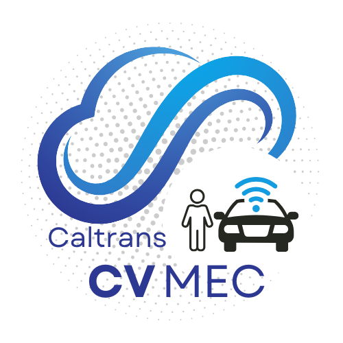

# v2x-mobile-app
This is the main repository for all code related to the Connected Vehicle Mobile Edge Compute (CV-MEC) mobile application. 

For a full list of features available in the CV-MEC application please see the 
- [supported feature list](docs/system_design/Feature_List.md)
- [changelog](docs/change_log.md)

## For Users
For users looking to see how to use the CV-MEC application please see the CV-MEC users guide pages
- [Home Page Overview](docs/user_guide/Welcome_to_the_CV-MEC_Application.md)
- [Map Page User Guide](docs/user_guide/Map_Buttons_User_Guide.md)
- [OBD-II Setup](docs/user_guide/OBD-II_Setup.md)
- [Pedestrian Configuration](docs/user_guide/Pedestrtian_Preferences_User_Guide.md)
- [Vehicle Configuration](docs/user_guide/Vehicle_Preferences_User_Guide.md)
- [Settings Overview](docs/user_guide/Settings_User_Guide.md)

## For Developers
For developers looking to get started with building and running the CV-MEC application, please reference the app setup guide [here](cv_mec/README.md)

For developers looking for higher level architectural and app background information please review the following.
- [System Architecture](docs/system_design/Architecture_and_High_Level_Design.md) 
- [Adding New TIM messages to the app](docs/system_design/Adding_additional_TIM%20messages.md)
- [Adding new MQTT servers to the app](docs/system_design/Modular_MQTT_Connections.md)
- [Managed Dependencies](docs/system_design/Managed_Packages.md)