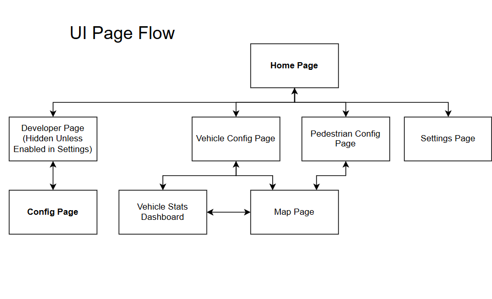
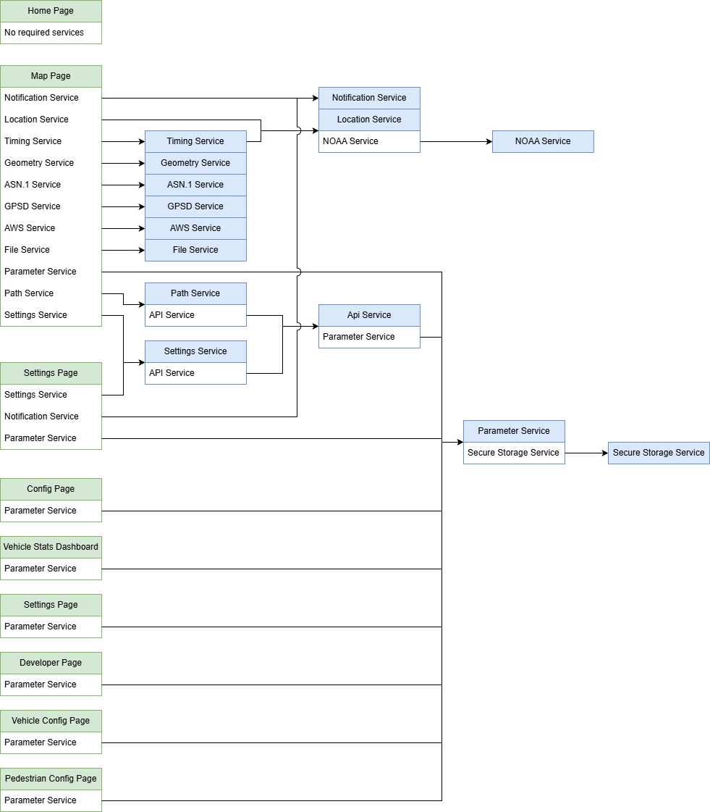
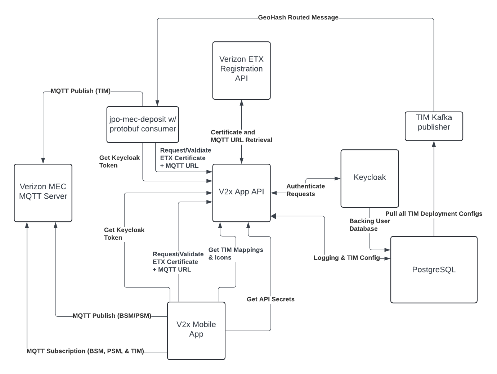
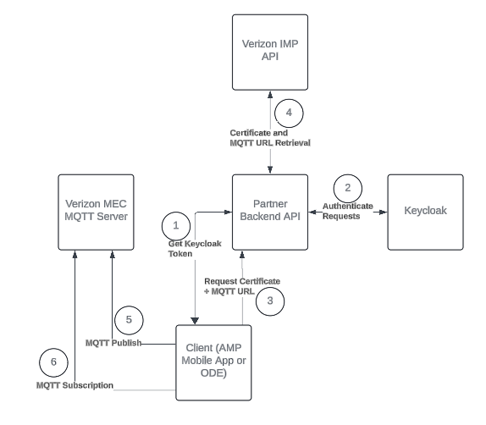


# Architecture and High-Level Design

# System Architecture

The CV-MEC application is comprised of a number of pages, models, services and views. The basic functionality of each subcomponent group is described below

**Pages -** Pages are the main screens that the user will interact with in the app such as the Home screen, Map screen, or Settings Screen. Each page includes references to multiple models, views and services. For example, the Map page may includes a reference to the GPS service so that it can get the users position and plot it on the map. Similarly, the Map page may have a list of BSM models that it can draw on the map to show the location of nearby vehicles. Pages define the user interface for the application as well as any styling with laying out the application. See the UI layout section below for additional information on how pages connect to one another.

**Views -** The CV-MEC will occasionally use overlays on top of a page to show menus or data dialogs. This functionality is encapsulated in views. Views are generally used to show data on-top of a page without requiring a full page context switch within the application. This allows for a single page to handle data from multiple menus without needing to manually pass data between multiple pages in a row.

**Models -** The CV-MEC application has dozens of different data types called models used in for representing data internally within the application. Models are instantiated many times during operation and used throughout the app. Models may be created and used in pages, views and services.

**Services** - The CV-MEC application utilizes services to handle common operations that may be needed by multiple pages or models. For example, the location service is responsible for providing the GPS location to other components. Services operate as singletons so only one instance of each service class is created at a time and dependent services are resolved using the dart GET X framework. This design paradigm allows for the app to use a single instance of the GPS service which reduced the calls to the system GPS hardware as well as ensuring data consistency between different components using the service.

# UI Layout of CV-MEC application

The UI Page Flow Diagram below describes how different pages of the [CV-MEC](https://github.com/usdot-fhwa-stol/v2x-mec-mobile-app "https://github.com/usdot-fhwa-stol/v2x-mec-mobile-app") application can transition between one another. The page flow demonstrated ensures that fields such as vehicle vs pedestrian are populated before the user attempts to connect to the MQTT brokers on the MAP page.

# Pages List

[**Home Page**](https://usdot-carma.atlassian.net/wiki/spaces/spectrum "https://usdot-carma.atlassian.net/wiki/spaces/spectrum") **-** Main landing page of the CV-MEC application, allows user to open the settings page, or to configure themselves as a vehicle or pedestrian. When in developer mode, this page also shows a button to access the developer page.

[**Vehicle Config Page**](https://usdot-carma.atlassian.net/wiki/spaces/spectrum/pages/3786342422 "https://usdot-carma.atlassian.net/wiki/spaces/spectrum/pages/3786342422") **-** This page includes multiple views to guide a user through configuring what type of vehicle they are driving. Views allow user to setup features such as vehicle color, type and size. After configuring their vehicle, the user is redirected to the map page.

[**Pedestrian Config Page**](https://usdot-carma.atlassian.net/wiki/spaces/spectrum/pages/3786440743 "https://usdot-carma.atlassian.net/wiki/spaces/spectrum/pages/3786440743") **-** This page includes multiple views to guide a user through configuring what type of pedestrian they are. Views allow for selecting pedestrian type (Person, Bicycle, Animal). After configuring themselves as a pedestrian the user is redirected to the map page.

[**Settings Page**](https://usdot-carma.atlassian.net/wiki/spaces/spectrum/pages/3789094927 "https://usdot-carma.atlassian.net/wiki/spaces/spectrum/pages/3789094927") **-** Accessible from the Home page, the settings page allows the user to configure how the application should function. This includes key settings such as enabling or disabling signing, turning on different MQTT agents, or configuring visual settings such as dark mode.

[**Map Page**](https://usdot-carma.atlassian.net/wiki/spaces/spectrum/pages/3786342431 "https://usdot-carma.atlassian.net/wiki/spaces/spectrum/pages/3786342431") **-** The map page is the core of the CV-MEC application and provides critical information to the user such as the location of nearby devices, Traveler Information Message alerts, and countdown information for traffic lights.

[**Vehicle Stats Dashboard**](https://usdot-carma.atlassian.net/wiki/spaces/spectrum/pages/3788996646 "https://usdot-carma.atlassian.net/wiki/spaces/spectrum/pages/3788996646") **-** This page shows basic data from a connected [OBD-II](https://en.wikipedia.org/wiki/On-board_diagnostics "https://en.wikipedia.org/wiki/On-board_diagnostics") device.

**Developer Page -** Used for development testing. Functionality various depending on release.

**Config Page -** Used for development testing configurations. Functionality various depending on release.

# Services list

[**API Service**](https://github.com/usdot-fhwa-stol/v2x-mec-mobile-app/blob/develop/cv_mec/lib/services/api_service.dart "https://github.com/usdot-fhwa-stol/v2x-mec-mobile-app/blob/develop/cv_mec/lib/services/api_service.dart") **-** The API Service handles retrieving certificates and connection information from the Partner API.

[**NOAA Service**](https://github.com/usdot-fhwa-stol/v2x-mec-mobile-app/blob/develop/cv_mec/lib/services/noaa_geomag_api.dart "https://github.com/usdot-fhwa-stol/v2x-mec-mobile-app/blob/develop/cv_mec/lib/services/noaa_geomag_api.dart") **-** The NOAA (National Oceanic and Atmospheric Administration) Service handles retrieving the geomagnetic offset of the user based upon their current position. This is used to improve GPS accuracy and heading data. For additional information on utilizing this API. Please see the API reference available [here](https://www.ncei.noaa.gov/maps/historical-declination/ "https://www.ncei.noaa.gov/maps/historical-declination/").

[**ASN.1 Service**](https://github.com/usdot-fhwa-stol/v2x-mec-mobile-app/blob/develop/cv_mec/lib/services/asn_service.dart "https://github.com/usdot-fhwa-stol/v2x-mec-mobile-app/blob/develop/cv_mec/lib/services/asn_service.dart") **-** The [ASN.1](https://en.wikipedia.org/wiki/ASN.1 "https://en.wikipedia.org/wiki/ASN.1")  Service is responsible for converting between UPER encoded [SAE J2735](https://saemobilus.sae.org/standards/j2735_202409-v2x-communications-message-set-dictionary#view "https://saemobilus.sae.org/standards/j2735_202409-v2x-communications-message-set-dictionary#view") messages and native dart data structures. The ASN Service integrated in the CV-MEC application is a wrapper layer around the [asn1_plugin](https://usdot-carma.atlassian.net/wiki/spaces/spectrum/pages/3626991617 "https://usdot-carma.atlassian.net/wiki/spaces/spectrum/pages/3626991617") managed package in the CV-MEC application.

[**MQTT Service**](https://github.com/usdot-fhwa-stol/v2x-mec-mobile-app/blob/develop/cv_mec/lib/services/mqtt_service.dart "https://github.com/usdot-fhwa-stol/v2x-mec-mobile-app/blob/develop/cv_mec/lib/services/mqtt_service.dart") **-** The [MQTT](https://mqtt.org/ "https://mqtt.org/") service manages connecting, sending and receiving messages from connected MQTT brokers. The CV-MEC application uses MQTT as its primary means for transmitting connected vehicle data between devices and from traffic infrastructure to mobile devices. Currently multiple different MQTT brokers are integrated into the application. For additional information on integrating MQTT service please see the Modular MQTT Connections framework described [here](https://usdot-carma.atlassian.net/wiki/spaces/spectrum/pages/3557916689 "https://usdot-carma.atlassian.net/wiki/spaces/spectrum/pages/3557916689").

[**AWS Service**](https://github.com/usdot-fhwa-stol/v2x-mec-mobile-app/blob/develop/cv_mec/lib/services/aws_service.dart "https://github.com/usdot-fhwa-stol/v2x-mec-mobile-app/blob/develop/cv_mec/lib/services/aws_service.dart") **-** The [AWS](https://aws.amazon.com/free/?trk=b5c65ab9-9a81-4490-a045-53b00fce9eed&sc_channel=ps&s_kwcid=AL!4422!10!71124885882248!!!!71125409442309!!482210371!1137995515727905&ef_id=e867e33c2532180a4cfd8bc6bf0d78ca:G:s "https://aws.amazon.com/free/?trk=b5c65ab9-9a81-4490-a045-53b00fce9eed&sc_channel=ps&s_kwcid=AL!4422!10!71124885882248!!!!71125409442309!!482210371!1137995515727905&ef_id=e867e33c2532180a4cfd8bc6bf0d78ca:G:s") service manages uploading log files from the CV-MEC application to an [AWS S3 Bucket](https://aws.amazon.com/s3/ "https://aws.amazon.com/s3/"). Uploaded log files are used to analyze real-time latency information and capture debug information from deployed instances of the CV-MEC application. This service is currently only used for S3 file uploading and provides some utility wrappers around the actual S3 upload logic which is provided by the [managed s3 package](https://usdot-carma.atlassian.net/wiki/spaces/spectrum/pages/3626991617 "https://usdot-carma.atlassian.net/wiki/spaces/spectrum/pages/3626991617").

[**Parameter Service**](https://github.com/usdot-fhwa-stol/v2x-mec-mobile-app/blob/develop/cv_mec/lib/services/param_controller.dart "https://github.com/usdot-fhwa-stol/v2x-mec-mobile-app/blob/develop/cv_mec/lib/services/param_controller.dart") **-** The Parameter Service is responsible for setting and tracking parameters set in the app. This includes preset values such as the Partner API url, as well as user set values such as vehicle configurations.

[**File Service**](https://github.com/usdot-fhwa-stol/v2x-mec-mobile-app/blob/develop/cv_mec/lib/services/file_service.dart "https://github.com/usdot-fhwa-stol/v2x-mec-mobile-app/blob/develop/cv_mec/lib/services/file_service.dart") **-** The File service is responsible for ensuring atomic file writes when generating log files for the CV-MEC applications. This service has special provisioning logic to ensure file read / write operations are handled sequentially and that file writes are not lost during high speed file updates.

[**Secure Storage Service**](https://github.com/usdot-fhwa-stol/v2x-mec-mobile-app/blob/develop/cv_mec/lib/services/secure_storage.dart "https://github.com/usdot-fhwa-stol/v2x-mec-mobile-app/blob/develop/cv_mec/lib/services/secure_storage.dart") **-** This service manages storing important information such as API credentials securely  on the local system using the appropriate system specific keychains. This system allows required variables to persist on the system between app restarts. For additional information on the security and encryption implemented by this package please are available [here](https://pub.dev/packages/flutter_secure_storage "https://pub.dev/packages/flutter_secure_storage").

[**Geometry Service**](https://github.com/usdot-fhwa-stol/v2x-mec-mobile-app/blob/develop/cv_mec/lib/services/geometry_service.dart "https://github.com/usdot-fhwa-stol/v2x-mec-mobile-app/blob/develop/cv_mec/lib/services/geometry_service.dart") **-** The Geometry Service handles all of the geospatial calculations in the CV-MEC application.

[**Timing Service**](https://github.com/usdot-fhwa-stol/v2x-mec-mobile-app/blob/develop/cv_mec/lib/services/timing.dart "https://github.com/usdot-fhwa-stol/v2x-mec-mobile-app/blob/develop/cv_mec/lib/services/timing.dart") **-** The timing service provides a central source of truth for time within the CV-MEC application. This service ensures time is monatomic within the application and helps to ensure app timing accuracy and consistency.

[**Location Service**](https://github.com/usdot-fhwa-stol/v2x-mec-mobile-app/blob/develop/cv_mec/lib/services/location_service.dart "https://github.com/usdot-fhwa-stol/v2x-mec-mobile-app/blob/develop/cv_mec/lib/services/location_service.dart") **-** The location service manages retrieving and updating the apps GPS position.

[**Notification Service**](https://github.com/usdot-fhwa-stol/v2x-mec-mobile-app/blob/develop/cv_mec/lib/services/vehicle_notification_manager.dart "https://github.com/usdot-fhwa-stol/v2x-mec-mobile-app/blob/develop/cv_mec/lib/services/vehicle_notification_manager.dart") **-**This service is responsible for creating, managing and deleting notifications that are shown

to a user.

[**Vehicle Service**](https://github.com/usdot-fhwa-stol/v2x-mec-mobile-app/blob/develop/cv_mec/lib/controllers/obd_controller.dart "https://github.com/usdot-fhwa-stol/v2x-mec-mobile-app/blob/develop/cv_mec/lib/controllers/obd_controller.dart") **-** This service manages connection to the vehicle via [the Bluetooth OBD-II adapter](https://www.obdlink.com/products/obdlink-mxp/ "https://www.obdlink.com/products/obdlink-mxp/"). It is responsible for creating data streams of vehicle information that can be used by the application for showing more accurate speed and RPM data. For information on configuring the OBD-II adapter within the application see the [OBD-II setup of the users guide](https://usdot-carma.atlassian.net/wiki/spaces/spectrum/pages/3788996646 "https://usdot-carma.atlassian.net/wiki/spaces/spectrum/pages/3788996646").

[**GPSD Service**](https://github.com/usdot-fhwa-stol/v2x-mec-mobile-app/blob/develop/cv_mec/lib/services/gpsd_service.dart "https://github.com/usdot-fhwa-stol/v2x-mec-mobile-app/blob/develop/cv_mec/lib/services/gpsd_service.dart") **-** This service manages connections to remote [GPSD](https://gpsd.io/ "https://gpsd.io/") brokers. It can be used for pulling in external GPS feeds such as the GPSD feed from a [Cradlepoint Cellular Modem](https://customer.cradlepoint.com/s/article/GPS-Getting-Started-Guide "https://customer.cradlepoint.com/s/article/GPS-Getting-Started-Guide").

# Service Dependency Graph

The below graphic outlines what services all of the pages and other services are dependent on in order to function properly.

# Network Architecture Graph

This graphic shows all of the connections used for interconnecting the various components of the CV-MEC application with the V2X partner API.

The Graphic below is a simplified version of above which shows the steps required for connecting the CV-MEC mobile application to the Verizon ETX Platform. The steps are as follows.

1.  Mobile app requests authentication token from backend partner API.    
2.  Backend Partner API forwards mobile app request to KeyCloak. If the user is valid Keycloak generates a token and returns it to the mobile app via the partner api connection.    
3.  Mobile app requests information about a broker (ETX Shown) from the Backend partner API. This request must include the token acquired in Steps 1/2.    
4.  Partner API reaches out to 3rd party server to acquire any necessarily credentials or broker information. In the graphic below the Verizon ETX is used as an example 3rd party server.    
5.  Using the MQTT broker information acquired in steps 4/5. The mobile application can now connect and start sending messages to the Verizon MQTT server.    
6.  The mobile app can now receive messages sent by other mobile applications from the MQTT server.

