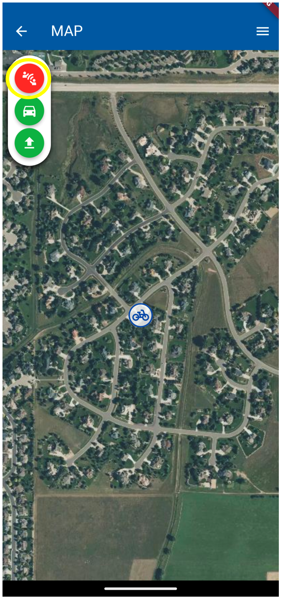
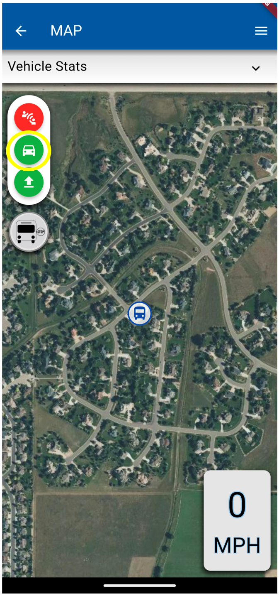
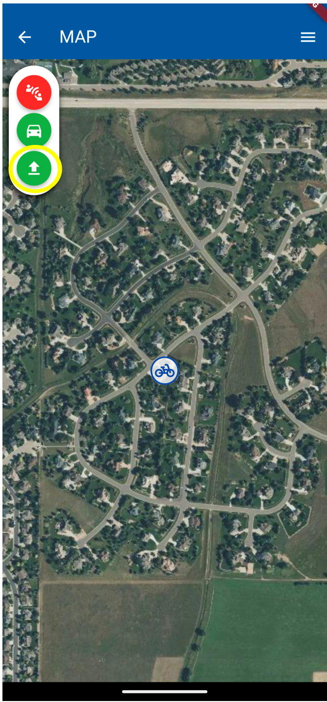
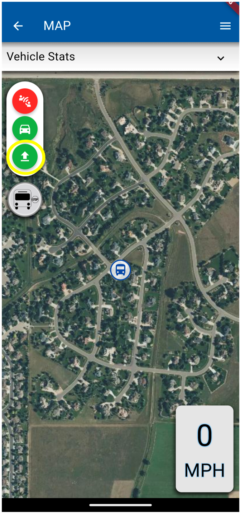
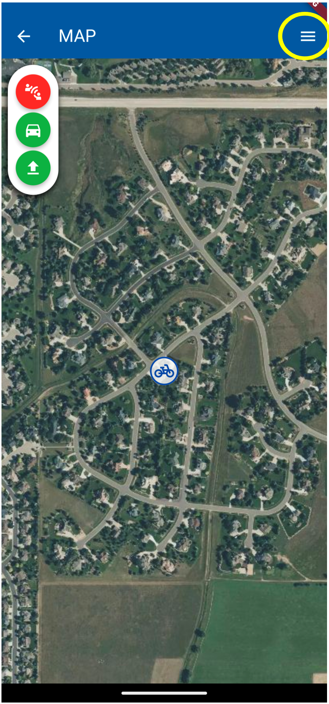
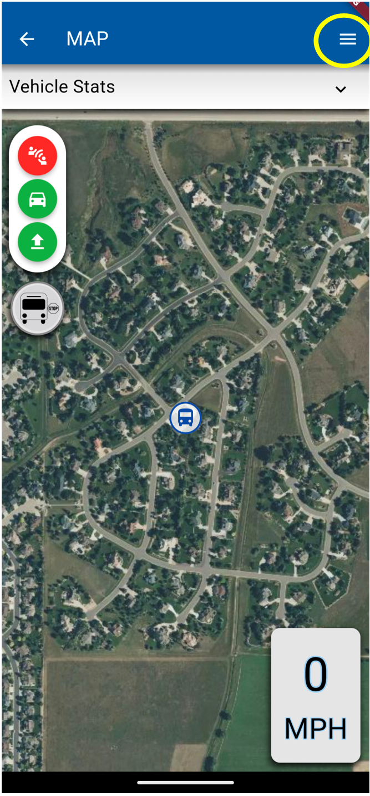
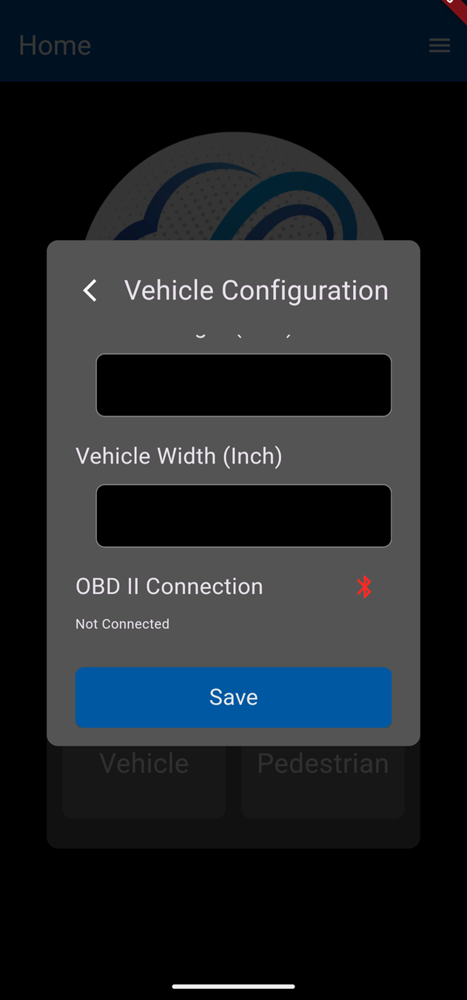
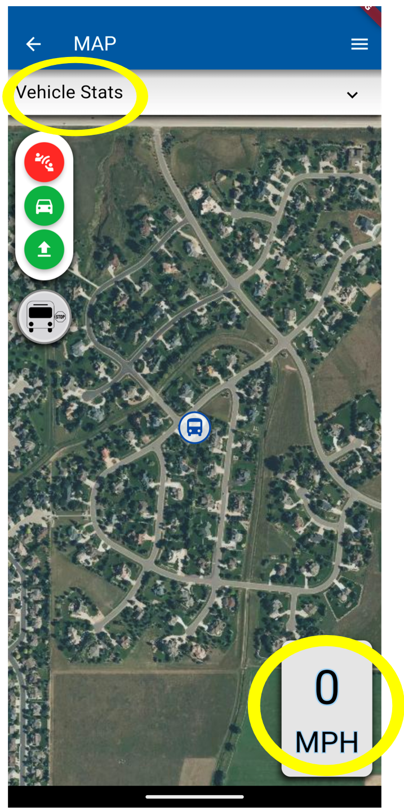

# Map Buttons User Guide
The Map view of the CV-MEC application has various features that allows users to interact with V2X technologies.

The top circle indicates if the app is connected to any MQTT brokers

-   RED: Not connected
-   ORANGE: Some of the available brokers are connected    
-   GREEN: All configured brokers are connected

Tapping this button at anytime (regardless of color) will trigger a reconnection to all MQTT brokers.

If the button is orange or red, first try tapping the button to restart available connections. If this doesn’t fix the issue verify the phone has internet access and verify your broker configurations in the settings menu.

The circle button in the middle on the top left of the screen (car icon) will recenter the screen to the pedestrian/vehicle icon. If the user pans away from the vehicle, the icon will turn blue.

-   Green: App will track the user    
-   Blue: App will show a static view on the map, regardless of user movement

The circle button on the bottom on the top left of the screen (arrow pointing up icon) will upload log data to the backend S3 Bucket. If the user doesn’t tap this button log data will be uploaded automatically in 5 minute intervals. Log uploads are not critical to app operation and will not stop app operation if they fail. No indication of upload success will be given to the user.

The three horizontal lines in the upper right of the screen direct users to the Home, Map, and Settings pages.

1.  Home page: redirects users to the “Start a session” page where users pick a Vehicle or Pedestrian.    
2.  Map page: refreshes the current map page the user is on.    
3.  Settings page: allows users to select various setting preferences. See the [Settings_User_Guide](Settings_User_Guide.md)

The Vehicle selection will display “Vehicle Stats” and “MPH” buttons on the map page. The Pedestrian selection will not display these buttons.

The “Vehicle Stats” allows users to click “Connect to ". This button will show “Select a Device”, which is a list of devices that are available for the user to connect to.

The MPH or Miles Per Hour will show the rate of speed the user is traveling in a vehicle.

