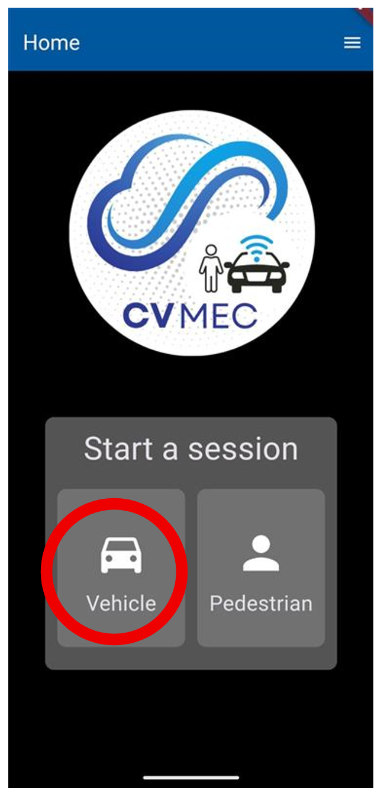
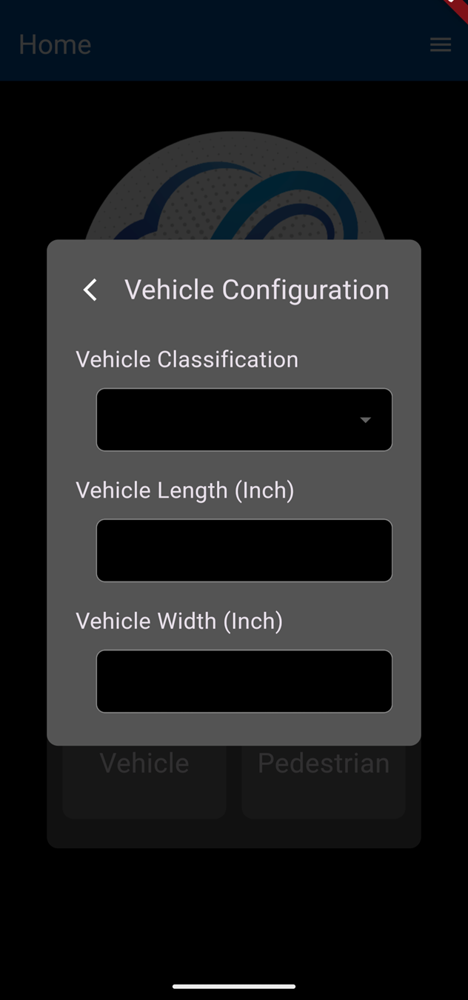
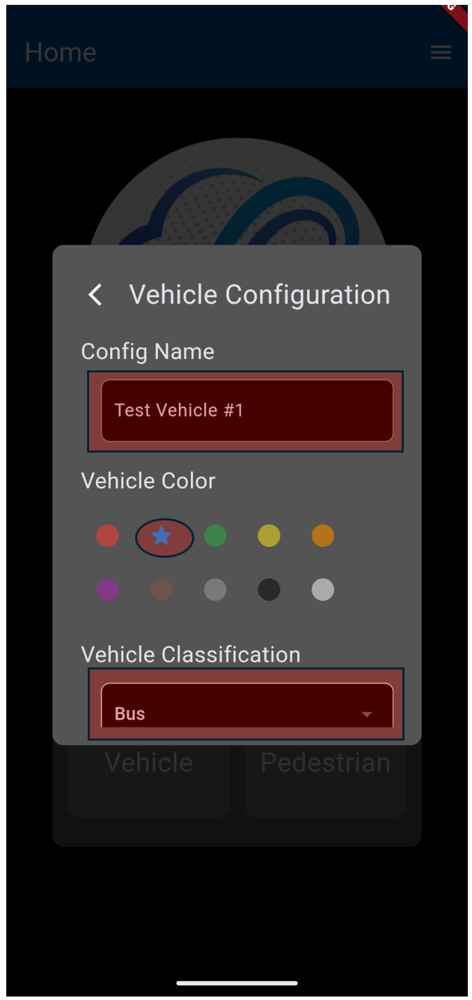
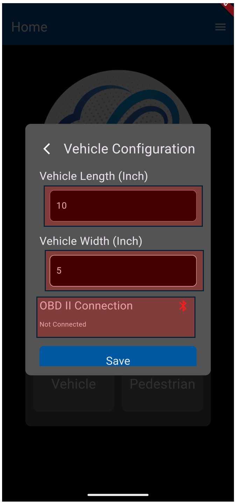
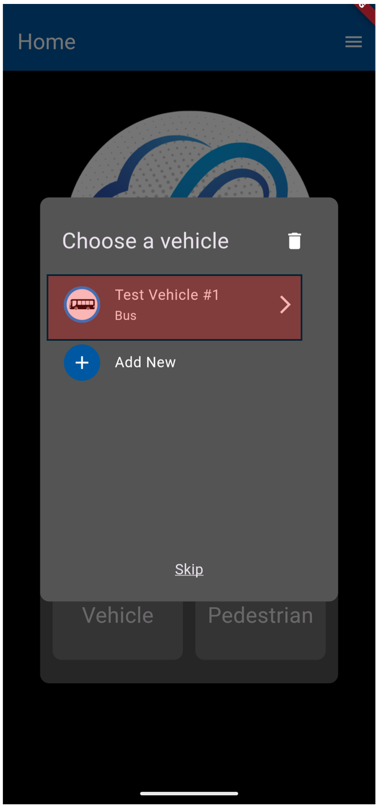
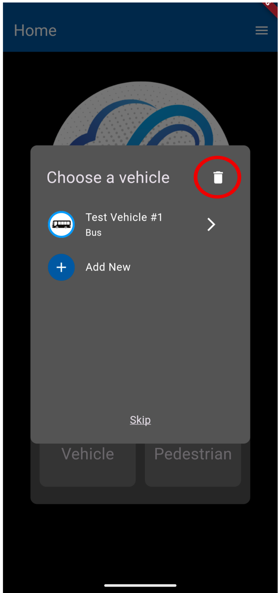
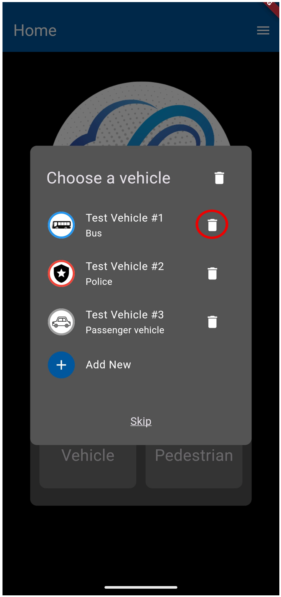
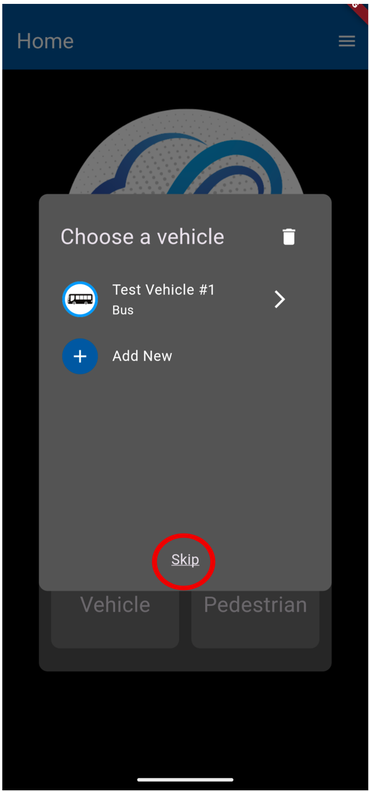
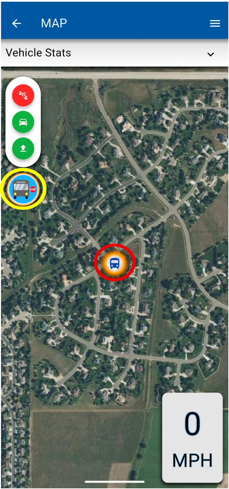

# Vehicle Preferences User Guide
Users have the option of operating as a Vehicle or a Pedestrian within the application.

The Vehicle option requires users to define various vehicle fields, like color, length and width.

The Pedestrian option requires users to define a type of non-vehicle option, like pedestrian, bicycle, or animal.

**Step 1:** For this user guide, click the “**Vehicle**” button.

**Step 2**: Click “Add New”

**Step 3**: Under “Vehicle Configuration”, users will determine:

1.  **Config Name**: (Text field) Users will fill out a specific name for the test vehicle
    
2.  **Vehicle Color**: (List field) Users will chose one color from the selection below. Once a color is selected, the color icon will turn into a star icon
    
    1.  Red
    2.  Blue
    3.  Green
    4.  Yellow
    5.  Orange
    6.  Purple
    7.  Brown
    8.  Gray
    9.  Black
    10.  White

        
3.  **Vehicle Classification**: (List field) Users will chose one vehicle options from the selection below. Based off the selection, a specific icon will show on the map. Each Vehicle classification maps to a certain vehicle type in the J2735 as listed below
    
    1.  Passenger vehicle - Vehicle Type: 11
    2.  Light truck - Vehicle Type: 20
    3.  Truck - Vehicle Type: 25
    4.  Motorcycle - Vehicle Type: 40
    5.  Bus - Vehicle Type: 50
    6.  Fire- Vehicle Type: 62
    7.  Police- Vehicle Type: 66
    8.  Ambulance- Vehicle Type: 69
    9.  Ice cream truck- Vehicle Type: 21
    10.  Other- Vehicle Type: 80
    
4.  Vehicle Length (Inch)
    
5.  Vehicle Width (Inch)

    
6.  OBD-II_Connection (Optional- see [OBD-II_Setup](<OBD-II_Setup.md>))

See the red highlighted fields in this example Vehicle Configuration

**Config Name**: Test Vehicle #1
**Vehicle Color**: Blue
**Vehicle Classification**: Bus
**Vehicle Length (Inch):** 10
**Vehicle Width (Inch):** 5
**OBD II Connection:** Field left blank/Not Connected

**Step 4:** Click “Save”

After clicking “Save”, the user will be directed to the “Choose a vehicle” page, where the vehicle the user created, and its preferences, are saved under the chosen name. See the red highlighted section.

The user can delete the vehicle by clicking the trash can icon.

After clicking the trash icon, another trash icon near the vehicle options will appear. Click the trash icon of the vehicle that the user wants to delete. Once deleted, the vehicle preferences cannot be recovered.

The user can create another vehicle by clicking the “Add New” button. Follow the instructions in **Step 3** for adding a new vehicle.

The user can skip these preferences and go straight to the map. The default car icon will appear on the map.

After clicking on a vehicle in the “Choose a vehicle” section, the user will be redirected to the map where an icon of the vehicle will appear in the geo-location of the user of the smart phone that the CV-MEC is downloaded on.

The icon on the map will move in near real-time with the movement of the user. The application will also display the miles per hour.

To read more about the map buttons, read the [Map_Buttons_User_Guide](<Map_Buttons_User_Guide.md>)

The vehicle type chosen for this example is a “Bus”. The Bus icon on the map displays a unique feature - when the Bus icon highlighted in yellow is pressed, the icon highlighted in red will display an orange halo. While this feature is active, the BSM message broadcast by the bus will indicate that the bus has its lights on and that nearby traffic needs to be extra careful. Common use cases of this include when the bus is picking up passengers or needs to stop at a railroad track.

