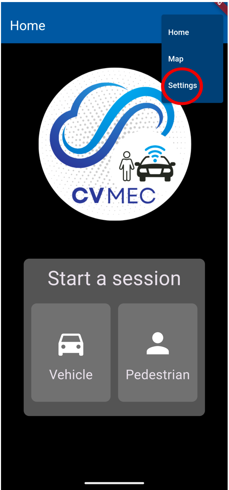
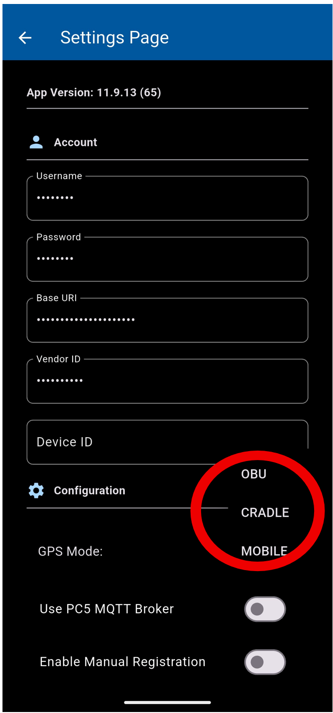
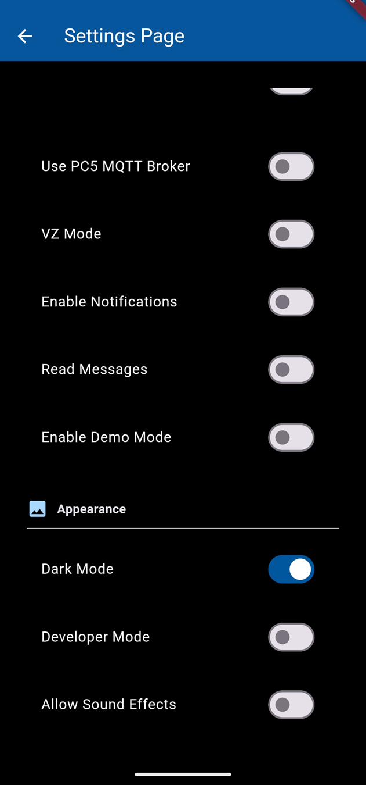

# Settings User Guide
The Settings page can be accessed on the Homepage or the Map page by clicking on the three horizontal lines in the upper right corner of the screen.

Under the Settings Page, the user will see:

1.  **Username**: The Username to use when connecting to the Partner API. If this is not populated contact the Partner API system administrator to get access.    
2.  **Password**: The Password to use when connecting to the Partner API. If this is not populated contact the Partner API system administrator to get access.    
3.  **Base URI**: The Location of the Partner API on the internet. If this is not populated contact the Partner API system administrator to get access.    
4.  **Vendor ID**: The name of the vendor associated with the Partner API. If this is not populated contact the Partner API system administrator to get access.    
5.  **Device ID**: Optional field for the user to differentiate their log name in AWS-S3 from another user. If left blank, device logs will be named after the device ID from the ETX connection.    
6.  **GPS Mode**: This setting dictates what the CV_MEC application should use for determining its GPS position. There are currently 3 supported options.    
    1.  OBU: Use a connected Ettifos OBU unit for connecting to the GPS. Recommended if OBU is available, this provides a high accuracy GPS with fast update rate.        
    2.  Cradle: Use the GPS feed of a connected Cradlepoint router. Useful for Linux deployments requiring an external GPS. However, suffers from lower accuracy and update rate.       
    3.  Mobile: Use a Mobile phones integrated GPS. This options is recommended for mobile users if an OBU is not available.
7.  **ENABLE PC5 MQTT Broker**: This setting enables receiving messages from a connected Ettifos OBU. This allows the CV_MEC application to visualize messages sent over PC5. *Note, CV-MEC will not send messages to the OBU. Only receive them.     
8.  **ENABLE ISS MQTT Broker:** This setting enables receiving and sending messages from the ISS MQTT broker.

9.  **ENABLE ETX MQTT Broker:** This setting enables receiving and sending messages from the Verizon ETX MQTT Broker
    
10.  **VZ Mode**: This is a specific setting which allows for users with Verizon phone plans to access a ultra high speed connection on the ETX. It has no effect on other mqtt services. *Note, If this setting is enabled it will prevent phones which are not using a verizon cell plan for internet from connecting. This may include devices which a verizon cell plan, but are connecting via some other internet connection such as Wi-Fi.
    
11.  **Enable Notifications:** When enabled the CV-MEC application will create system pop-up messages (similar to text message alerts) for alerts such as pedestrian or TIM messages.
    
12.   **Read Messages**: When enabled the CV-MEC application will read notifications aloud to users. This setting will not do anything if Enable notifications is not enabled.
    
13.   **Enable Dark Mode**: This feature allows users to pick Dark Mode when using the CV-MEC application. If the user does not turn on Dark Mode, the application will display in Light Mode by default.
    
14.   **Developer Mode**: A special app mode used by the development team to easily switch into debugging mode. As this is a development feature the particular changes of this feature will vary with each release.
    
15.   **Allow Sound Effects**: This setting enables certain vehicle types (such as police cars) to produce an audible sound effect from the app when their sirens are on.
    
16.   **Enable Signing:** This setting configures the CV-MEC application to sign each message it sends using the ISS SDK. Currently this setting is only supported on Android Devices. Note: This setting doesn’t apply to the Verizon ETX which requires messages are sent unsigned to work properly.

