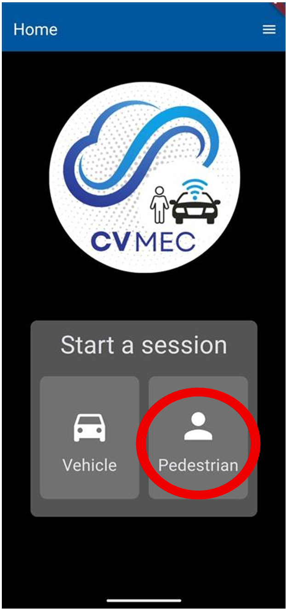
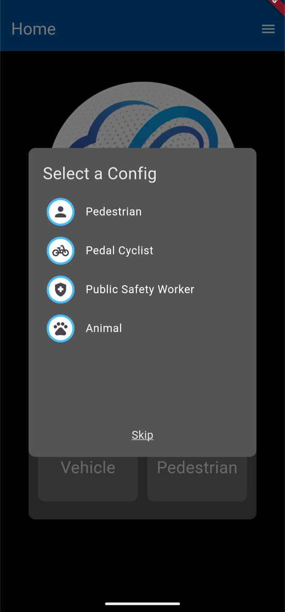
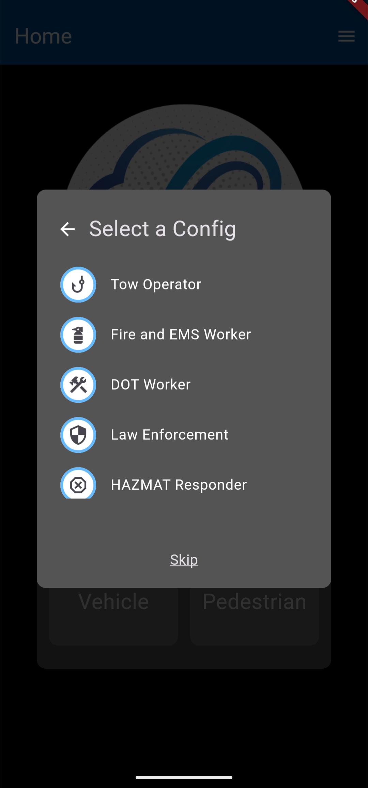
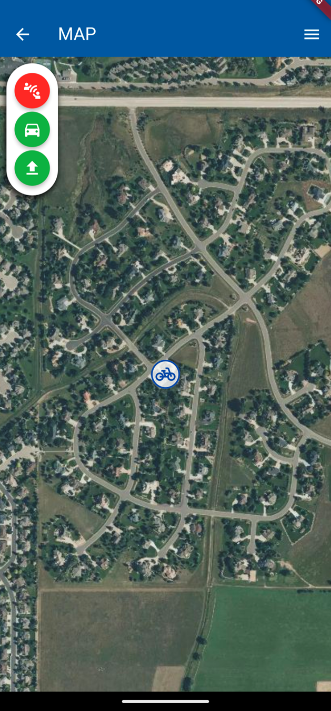

# Pedestrian Preferences User Guide
Users that select “Pedestrian” have various non-vehicle options to test V2X technology within the CV-MEC application.

**Step 1:** For this user guide, click the “**Pedestrian**” button.

**Step 2:** Users will chose an option from the “**Select a Config**” list

1.  Pedestrian
2.  Pedal Cyclist    
3.  Public Safety Worker    
    1.  Tow Operator        
    2.  Fire and EMS Workers        
    3.  DOT Worker        
    4.  Law Enforcement        
    5.  HAZMAT Responder        
4.  Animal

These are the configuration options for Public Safety Workers. Each selection has a unique icon that displays on the map.

**Step 3:** After selecting a configuration, the user will automatically be redirected to the map where an icon of the pedestrian will appear in the geo-location of the user of the smart phone that the CV-MEC is downloaded on.

The icon on the map will move in near real-time with the movement of the user.

To read more about the map buttons, read the [Map_Buttons_User_Guide](<Map_Buttons_User_Guide.md>)

